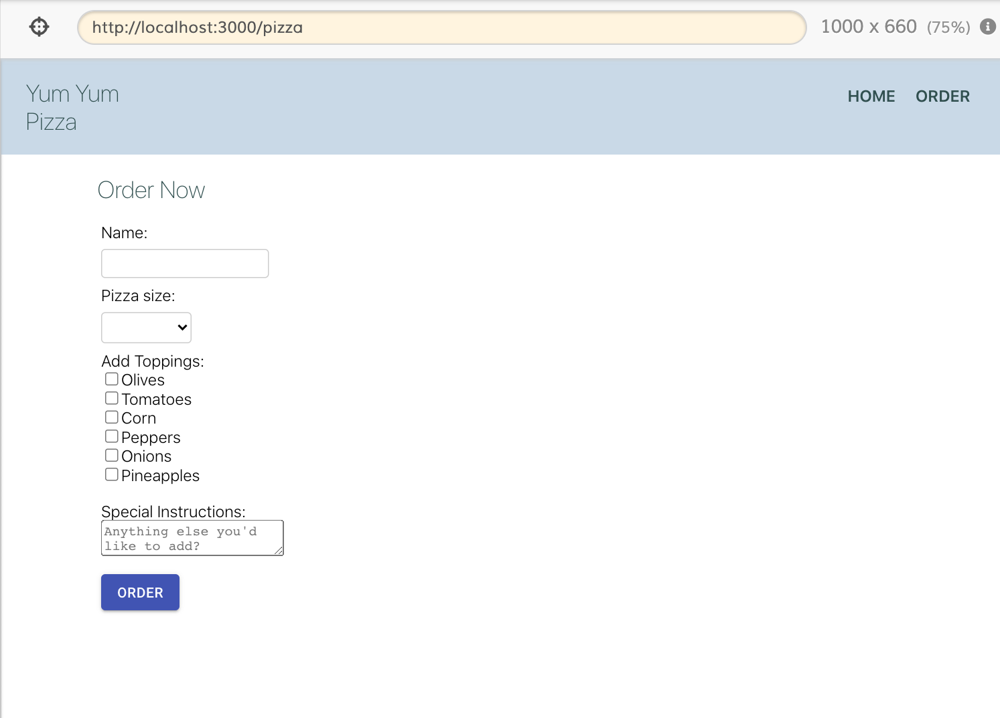

# Order-Pizza-React-Single-Page-App
A Single Page Application built with React. The form is using yup for validation and submits the order to the mock-up url. If the order was successful, the app will go to the "/success" url. This sample app was also used to learn automated testing (cypress.io) 

